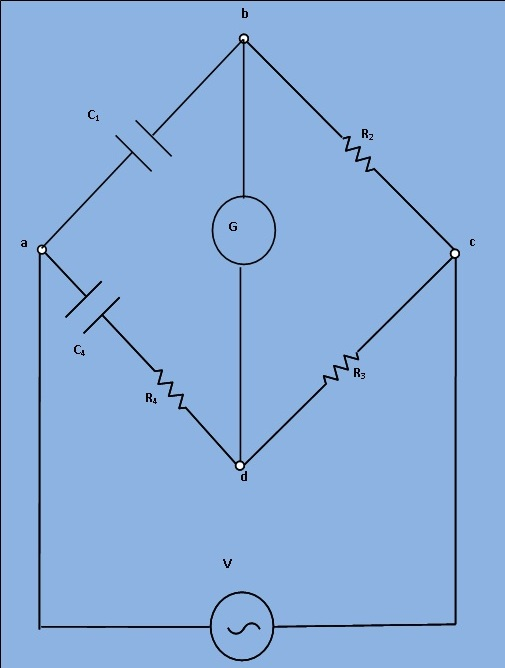

## Procedure

***Fig.1 Circuit digram of experimental set-up for Wien Series Capacitance measurement Bridge***

1. Apply supply voltage from the signal generator V=3V at frequency 50Hz. Also set the unknown capacitance value from 'Set capacitor value' tab.
  
2. Then switch on the supply to get millivoltmeter deflection.
  
3. Choose the values of  R2, R3, R4 and C4 from the resistance and capacitance box.
  
4. Observe the millivoltmeter pointer to achieve "Null".
  
5. If "NULL" is achieved, switch to 'Measure capacitance value' tab and click on 'Simulate'. Observe calculated values of unknown capacitance (C2) and unknown internal resistance (r2) of the capacitor.
  
6. Also observe the Dissipation factor of the unknwown capacitor which is defined as ω⋅C⋅r. Where, ω=2πf.

