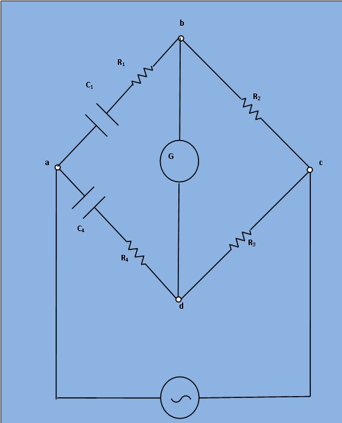

## Theory

***Fig.1 : Circuit diagram for measurement of capacitance by Wien Series Bridge***

Let,  

C1= Capacitor whose capacitance is to be measured,

R1= A series resistance representing the loss in the capacitor C1,

C4 = A standard capacitance with series resistance of R4,

R2 and R3 = Non-inductive resistances.

At balance, 

$$(R_1 +\frac{1}{(jωC_1)}) * R_3 = (R_4 + \frac{1}{ (jωC_4)}) * R_2 ..........(1)$$

$$R_1R_3+\frac{R_3}{jωC_1}=R_2R_4+\frac{R_2}{jωC_4} ..........(2)$$

Equating the real and imaginary terms,

$$R_1R_3=R_2R_4$$
$$R_1=\frac{R_2R_4}{R_3}$$
and ,      $$ \frac{R3}{jωC1}= \frac{R2}{jωC4} $$
$$C_1=\frac{C_4R_3}{R_2}$$

If the bridge in Fig.1 is used to measure capacitance ,  it may be written as 

$$C_1=\frac{C_4R_3}{R_2}..........(3)$$

$$R_1=\frac{R_2R_4}{R_3}..........(4)$$

The dissipation factor of capacitance C1 is defined as,

$$D_1=ωC_1R_1..........(5)$$

 

 While in measurement of capacitance C1 , R1   is not a separate unit but represents the equivalent series resistance of the capacitor and thus can be determined in terms of the elements of the bridge.
 
 
